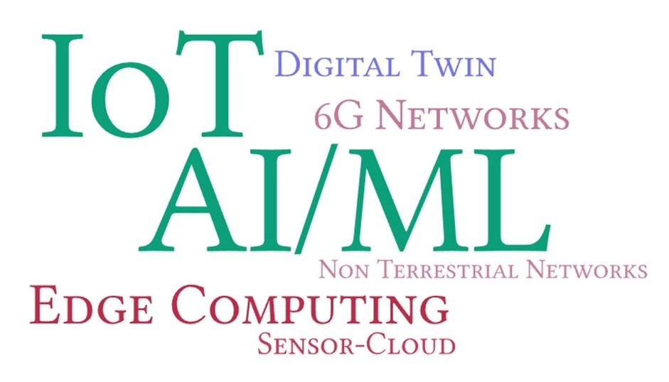

## Research Group: [COSINE Lab](https://people.iitism.ac.in/~cosinelab/)

### Research Domains

### Research Grants
* May 2025 - May 2027: Energy-Efficient Federated Deep Reinforcement Learning for Multi-UAV Edge Intelligence Using Tiny Models, _IIT (ISM) Dhnabad_, Amount: INR 19,99,800. (PI)
* Mar. 2025 - Sept. 2026: AI-Powered Vision Systems for Low-light and Low-visibility Underground Mining Environments, _TEXMiN Foundation (DST TIH)_, Amount: INR 17,35,000. (Co-PI)
* Nov. 2024: Special Lab establishment grant, _IIT (ISM) Dhnabad_, Amount: INR 29,97,000. (PI)
* Oct. 2023: Using Edge Intelligence for Resource Allocation in Wirelessly Powered UAV-IoT Network, _SRM University-AP (Seed Grant)_, Amount: INR 15,24,000. (PI)
* Oct. 2018 - June 2019: Breaking the Barriers of Skin Disease Diagnosis with Computational Imaging and Artificial Intelligence, _SINE, IIT Bombay and Intel Inc. (Plugin 2 Startup Cohort)_, Amount: INR 10,00,000. (Co-PI)
* Aug. 2015 - Jan. 2017: Multispectral Optical Imaging and Computing Technologies for Realtime in-situ Functional Characterization and Monitoring of Cutaneous Wound Healing Progression, _BIRAC, DBT, Govt. of India (BIG grant)_, Amount: INR 41,79,000. (Co-PI)

<b>[COSINE Lab](https://people.iitism.ac.in/~cosinelab/) is hiring:</b> I am looking for motivated and aspiring candidates for PhD positions (current vacancy: 2). Candidates interested working in areas such as UAV-IoT networks, Edge computing, Non-terrestrial networks, digital twin, and edge-cloud-continuum may write to me with a copy of their updated CV. For more information about the eligibility criteria, benefits, and fellowship of PhD program, you may visit the following links -- [PhD program](https://admission.iitism.ac.in/index.php/admission/phd).

<!--- 
### AI/ML for 6G-enabled IoT

### Wirelessly Powered IoT
The emergence of wireless power transfer (WPT) technologies has enabled mobile and portable devices to be charged wirelessly without depending on cables, so as to continue executing their applications seamlessly. Typically, these devices can be charged wirelessly from different types of power sources such as wireless charging pads and mobile charging vehicles. In this regard, wirelessly powered Internet of Things (IoT) has emerged as a promising solution for powering and communicating with IoT devices without the limitations of traditional wired connections or battery replacements. However, several research issues still need to be addressed to optimize the UAV-IoT power transfer along with various constraints in coverage, trajectory, and device capabilities. On the other hand, the use of peer-to-peer (P2P) WPT methods empower a mobile device to recharge by directly interacting and exchanging energy with nearby mobile devices, thereby providing the flexibility to leverage the nearby peer power sources while maintaining their own mobility. In our current research, our objective is to achieve an energy balancing of the network such that the average network energy is maximized while mitigating various challenges associated with the interaction among the deployed nodes. In UAV-IoT, we are working on devising solutions for increased utility for WPT between UAV and IoT considering various constraints and requirements of both UAV and IoT nodes.

### Provisioning sensors-as-a-service in sensor-cloud
The Sensor-cloud architecture has depicted improvement over Wireless Sensor Networks (WSNs) for realizing Internet of Things (IoT) applications. Sensor-Cloud enables improved processing and management of sensed information, while supporting multiple users and heterogeneous applications in a single platform for a large-scale deployment of IoT. This framework provides a virtualized platform for offering sensors-as-a-service (Se-aaS), which facilitates dynamic management of sensing and computing resources by information sharing among the stakeholder entities such as Sensor-Cloud Service Provider (SCSP), sensor owners (SOs), and end-users. Using this framework, the SOs can achieve energy-efficiency of the deployed nodes, while the SCSP can provide services to various end-users, considering the user-specific requirements. The abstraction provided by the framework ensures secure information sharing among the SOs, and helps in better collaboration and coordination among the deployed nodes. In my PhD thesis, different schemes were designed for delivering Sensor-Cloud-based IoT platform to enable energy-efficient dynamic provisioning of the deployed sensors, while maintaining user- and service-specific Quality-of-Service (QoS) parameters. Specifically, the participation of the different stakeholders in the decision making process was considered while designing these schemes. The economic aspect of the framework was also studied, while devising the revenue distribution technique.

### Architecture and localization in underwater sensor networks
Underwater Sensor Networks (UWSNs) pose challenges that differ from those of the terrestrial wireless sensor networks (WSNs) in many respects — passive node mobility is one of them. Due to the effect of passive node mobility, the network topology changes rapidly with time. This spatial variability of the network topology affects the connectivity between the sensor nodes, and the hop-to-hop data delivery based schemes face temporary losses of connectivity. As a result of this, the basic network functionalities, such as reporting of sensed data of the UWSN, are affected. Accordingly, an energy-efficient UWSN architecture, which is capable of providing a communication guarantee between the source sensor nodes and the surface sinks was proposed.

In UWSNs, it is important to tag the sensed data with location information, in order to have better insight of the sensed information. Consequently, a sensor node needs to know its time-varying location. The existing localization schemes exhibit performance challenges such as high energy consumption, high localization error, reduced localization coverage, and high beacon message overhead. Motivated by this, a static anchor-based and a mobile anchor-based localization scheme exhibiting low energy consumption, high localization coverage and less location estimation error was proposed. The traditional approaches for iterative localization do not work specifically for sparse node deployment scenarios. In such scenarios, the sensor nodes lack the required number of anchor nodes for localization. Also, the mobile-anchor based schemes are deficient in achieving network-wide localization coverage in such scenarios. Accordingly, two localization schemes -- a static anchor-based and a mobile anchor-based -- were designed specifically considering the sparse UWSN scenario.

-->

